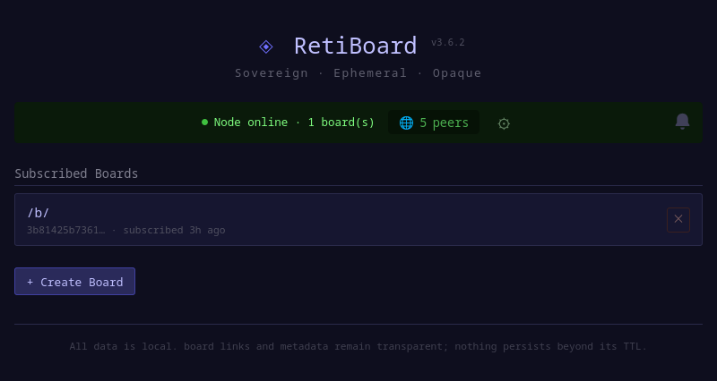
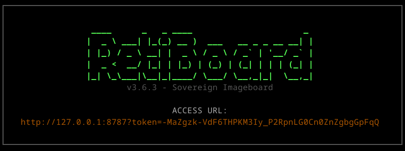

# RetiBoard (v3.6.4)

Sovereign, Ephemeral, Decentralized Imageboard over [Reticulum](https://reticulum.network/).

RetiBoard is a censorship-resistant anonymous imageboard built on the Reticulum Network Stack (RNS). It recreates the classic imageboard experience—catalog views, thread bumping, and media sharing—without any centralized storage or infrastructure.





## Core Pillars

1.  **Sovereign & Ephemeral** — All data lives on end-user machines. Threads are short-lived (12h default TTL) and aggressively pruned.
2.  **Infrastructure Neutrality** — Reticulum nodes only route; they do not store or index.
3.  **Strict Content Opacity** — The backend is 100% content-blind. It handles encrypted blobs but never holds decryption keys or inspects payloads.
4.  **Client-Side Governance** — Moderation, filtering, and fetch policies are 100% local decisions.

## Features

- **P2P Sync:** Gossip-based synchronization via LXMF.
- **Chunked Transfers:** Multi-peer payload transfer with resume-safe fetching.
- **Privacy:** AES-GCM encryption with HKDF key derivation (client-side).
- **Anti-Spam:** Per-board Proof-of-Work (PoW) difficulty.
- **Network Resilience:** Optimized for both high-bandwidth and LoRa/low-speed links.

## Prerequisites

- **Python:** 3.10+
- **Node.js:** 18+ (for frontend build)
- **Reticulum:** A working `rns` installation.

## Developer Setup

RetiBoard is currently in active development. Binary releases are not yet provided, and building from source is the recommended path for enthusiasts.

### 1. Backend Installation
```bash
# Clone the repository
git clone https://github.com/user/retiboard.git
cd retiboard

# Install in editable mode
pip install -e .
# — or with uv —
uv sync
```

### 2. Frontend Build
```bash
cd frontend
npm install
npm run build
cd ..
```

### 3. Running RetiBoard
```bash
# Start as a full client (Web UI + Node)
python -m retiboard

# Start in Relay Mode (Headless, no UI, purely for network participation)
python -m retiboard --relay
```

Access the Web UI at `http://127.0.0.1:8787` (default).

## Known Issues & Notes

- **Linux Binary Build:** Compiling a standalone binary (e.g., via Nuitka) is currently non-trivial and may require manual patches to the `rns` library's Identity initialization. It is recommended to run via the Python interpreter for now.
- **Identity:** RetiBoard uses native Reticulum identities. Ensure your `~/.retiboard/identity` is backed up if you wish to preserve your node's identity.

## Specification

For detailed protocol, synchronization, and data model information, see:
`docs/RetiBoard_v3_6_4_spec.md`

## License

RetiBoard is released under the **GNU Affero General Public License v3.0 (AGPL-3.0)**. See the `LICENSE` file for details.
